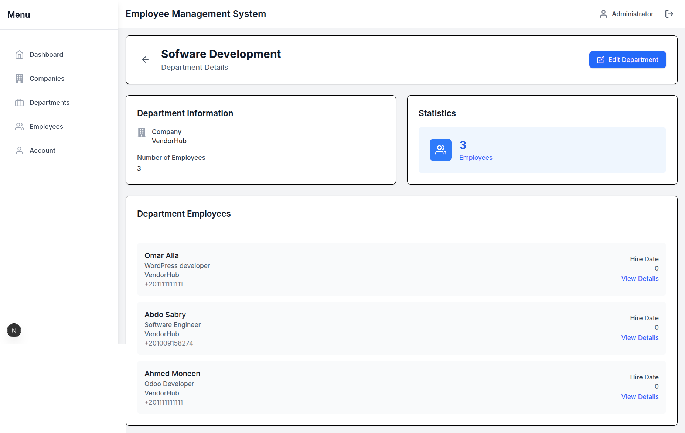
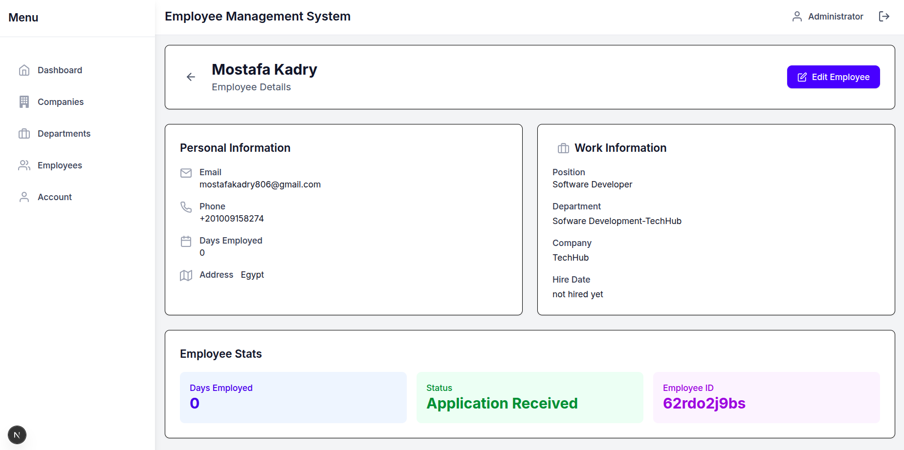
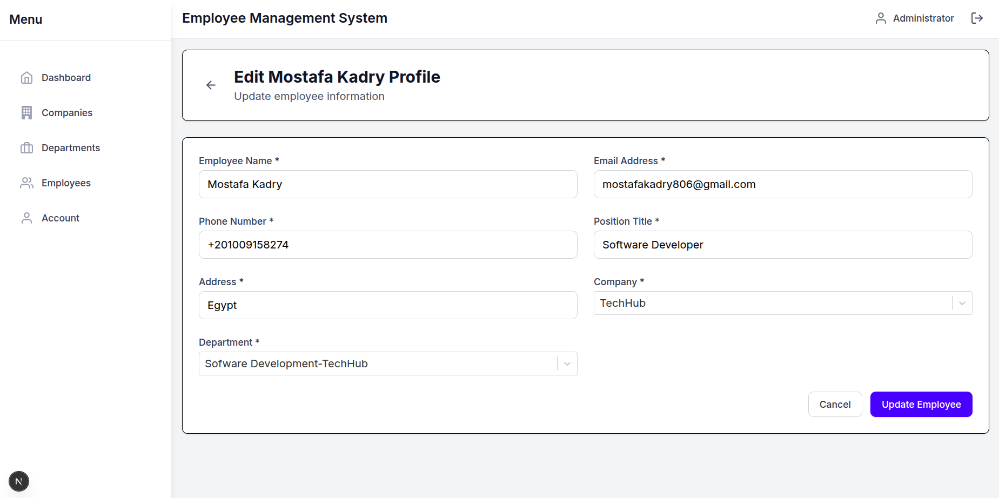
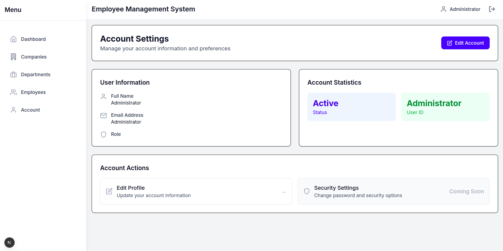
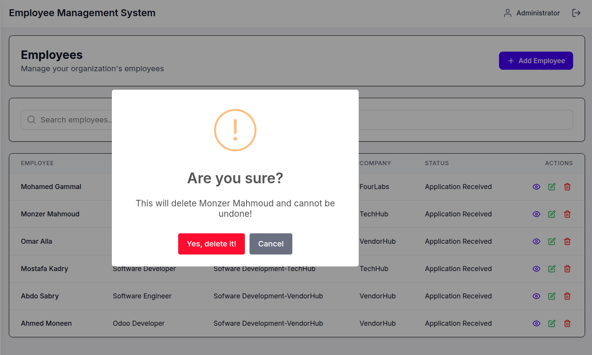

<div align="center">
  <h1>🏢 Employee Management System</h1>
  <p>A modern web application for managing companies, departments, and employees.</p>
  
  [](https://opensource.org/licenses/MIT)
  [](https://nextjs.org/)
  [](https://reactjs.org/)
</div>

A comprehensive employee management system built with Next.js, React, and Tailwind CSS. This application allows organizations to manage companies, departments, and employees with a clean, intuitive user interface.
---

Note before proceeds:
I had two options for building this project: React/Next.js or Vue.js. Since I’m proficient in both, I could have developed it using either. However, in the end, I decided to go with Next.js.

---
## 📸 Screenshots


 
 
 
 






## ✨ Key Features

- **Company Management**
  - Full CRUD operations for companies
  - View company details and relationships
  
- **Department Management**
  - Organize departments within companies
  - Track department hierarchy
  
- **Employee Directory**
  - Comprehensive employee profiles
  - Role-based access control
  
- **Responsive Design**
  - Works on all device sizes
  - Mobile-first approach

## 🛠️ Tech Stack

| Category        | Technologies                         |
|----------------|--------------------------------------|
| **Frontend**   | Next.js 15  , React 19              |
| **Styling**    | Tailwind CSS                         |
| **State**      | React Context API                    |
| **Forms**      | React Hook Form, React Select        |
| **HTTP**       | Axios                               |
| **UI**         | React Icons, Headless UI            |
| **Deployment** | Vercel                              |

## 🚀 Quick Start

### Prerequisites
- Node.js 19.0.0
- npm or yarn
- Modern web browser

### Installation

1. **Clone the repository**
   ```bash
   git clone https://github.com/MostafaKadry/employee-app.git
   cd employee-app
   ```

2. **Install dependencies**
   ```bash
   npm install
   # or
   yarn install
   ```

3. **Environment Setup**
   Create `.env`:
   ```env
   NEXT_PUBLIC_API_URL=your_api_endpoint
   ```

4. **Start Development Server**
   ```bash
   npm run dev
   # or
   yarn dev
   ```
   Visit [http://localhost:3000](http://localhost:3000)

## 🏗️ Project Structure

```
src/
├── app/                    # App router pages
│   ├── account/           # User account management
│   ├── companies/         # Company management
│   ├── departments/       # Department management
│   ├── employees/         # Employee management
│   └── dashboard/         # Main dashboard
├── components/            # Reusable UI components
├── context/              # React context providers
│   └── AppContext.js     # Global application state
│   └── AuthContext.js    # Authentication state
└── services/             # API service layer
    ├── apiConfig.js     # Axios configuration
    ├── company/        # Company API services
    ├── departments/     # Department API services
    └── employee/       # Employee API services
```

## 🔐 Authentication & Authorization

The application implements role-based access control (RBAC) using Frappe's authentication system:

- **Admin**: Full access to all features
- **HR Manager**: Manage employees and departments
- **Employee**: Limited to viewing own profile

## ✅ Feature Status

| Feature                     | Status |
|----------------------------|--------|
| User Authentication        | ✅     |
| Company Management         | ✅     |
| Department Management      | ✅     |
| Employee Directory         | ✅     |
| Responsive Design          | ✅     |
| Form Validation            | ✅     |
| Error Handling             | ✅     |
| Loading States             | ✅     |
| Toast Notifications        | ✅     |

## 🔒 Security

- **Authentication**: JWT-based authentication
- **Authorization**: Role-based access control
- **Input Validation**: Client and server-side validation
- **Secure Headers**: Implemented security headers
- **API Protection**: Rate limiting and CORS policies

## 🤝 Contributing

We welcome contributions! Here's how you can help:

1. Fork the repository
2. Create a feature branch (`git checkout -b feature/AmazingFeature`)
3. Commit your changes (`git commit -m 'Add some AmazingFeature'`)
4. Push to the branch (`git push origin feature/AmazingFeature`)
5. Open a Pull Request

## 📄 License

This project is licensed under the MIT License - see the [LICENSE](LICENSE) file for details.

## 📝 Author

- **Mostafa Kadry** - [GitHub](https://github.com/MostafaKadry) | [LinkedIn](https://www.linkedin.com/in/mostafa-kadry-040440169/)

## 🙏 Acknowledgments

- Frappe Framework for the backend API
- Next.js and React communities
- All contributors and users

---

<div align="center">
  Made with ❤️ by Mostafa Kadry
</div>
