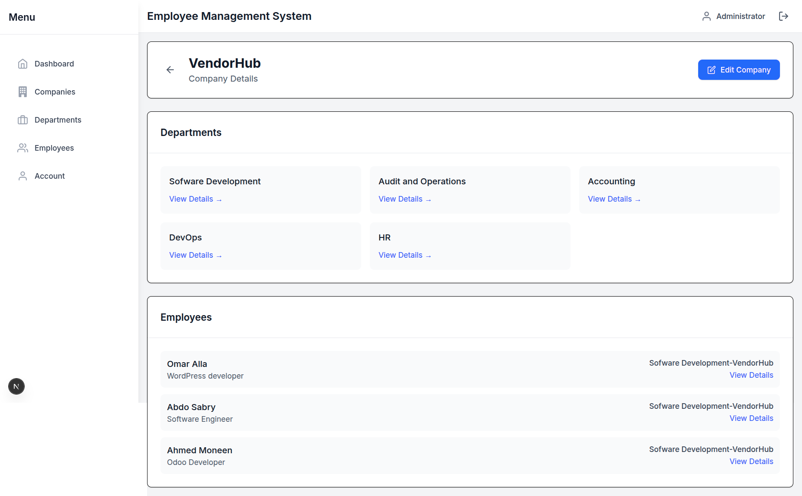
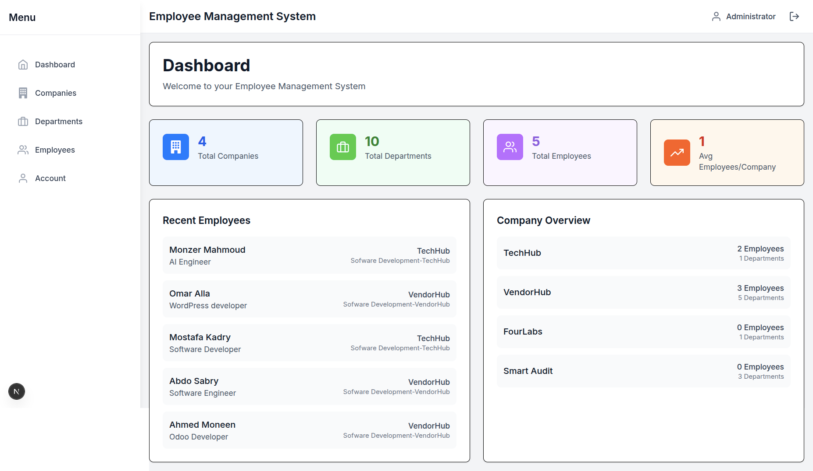
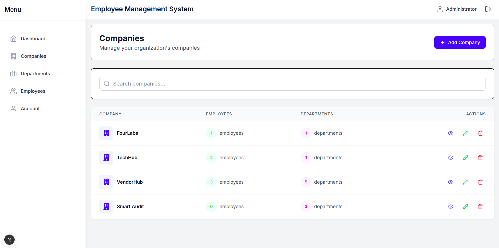
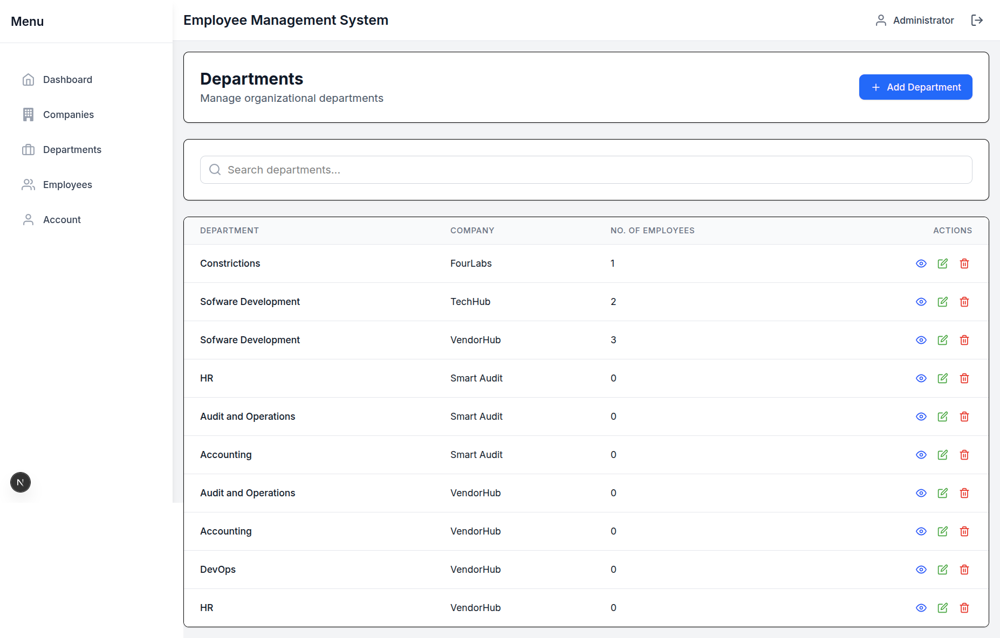
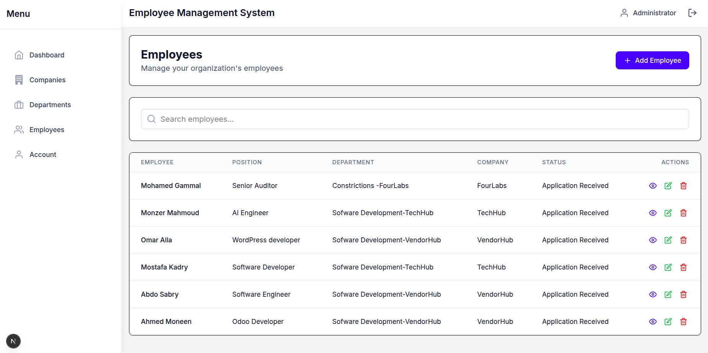

# Employee Management Application

A comprehensive employee management system built with Next.js, React, and Tailwind CSS. This application allows organizations to manage companies, departments, and employees with a clean, intuitive user interface.



## 📸 Screenshots


 
 
 
 

## 🚀 Features

- **Company Management**: Create, view, edit, and delete company records
- **Department Management**: Organize departments within companies
- **Employee Directory**: Manage employee information and assignments
- **User Authentication**: Secure access control with role-based permissions
- **Responsive Design**: Works on desktop and mobile devices
- **Modern UI**: Built with Tailwind CSS for a clean, professional look

## 🛠️ Tech Stack

- **Frontend**: Next.js 13+ (App Router)
- **Styling**: Tailwind CSS
- **State Management**: React Context API
- **Form Handling**: React Hook Form
- **HTTP Client**: Axios
- **Notifications**: React Hot Toast
- **UI Components**: React Icons, React Select
- **Deployment**: Vercel (recommended)

## 📋 Prerequisites

- Node.js 18.0.0 or later
- npm or yarn package manager
- Modern web browser (Chrome, Firefox, Safari, Edge)

## 🚀 Getting Started

### 1. Clone the Repository

```bash
git clone [your-repository-url]
cd employee-app
```

### 2. Install Dependencies

```bash
npm install
# or
yarn install
```

### 3. Environment Setup

Create a `.env.local` file in the root directory and add your environment variables:

```env
NEXT_PUBLIC_API_URL=your_api_url_here
# Add other environment variables as needed
```

### 4. Add Screenshots (Optional)

To add screenshots to your project:

1. Place your screenshot images in the `public/images/` directory
2. Use the following format to include them in the README:
   ```markdown
   
   ```

### 5. Run the Development Server

```bash
npm run dev
# or
yarn dev
```

Open [http://localhost:3000](http://localhost:3000) in your browser to see the application.

## 🏗️ Project Structure

```
src/
├── app/                    # App router pages
│   ├── account/           # User account management
│   ├── companies/         # Company management
│   ├── departments/       # Department management
│   ├── employees/         # Employee management
│   └── dashboard/         # Main dashboard
├── components/            # Reusable UI components
├── context/               # React context providers
└── services/              # API service layer
```

## 🔐 Authentication & Authorization

The application implements role-based access control (RBAC) with the following roles:

- **Admin**: Full access to all features
- **Manager**: Can manage departments and employees within their company
- **Employee**: Limited to viewing their own information

## 📚 API Documentation

### Authentication

- `POST /api/auth/login` - User login
- `POST /api/auth/register` - Register new user
- `POST /api/auth/logout` - User logout

### Companies

- `GET /api/companies` - List all companies
- `POST /api/companies` - Create new company
- `GET /api/companies/:id` - Get company details
- `PUT /api/companies/:id` - Update company
- `DELETE /api/companies/:id` - Delete company

### Departments

- `GET /api/departments` - List all departments
- `POST /api/departments` - Create new department
- `GET /api/departments/:id` - Get department details
- `PUT /api/departments/:id` - Update department
- `DELETE /api/departments/:id` - Delete department

### Employees

- `GET /api/employees` - List all employees
- `POST /api/employees` - Create new employee
- `GET /api/employees/:id` - Get employee details
- `PUT /api/employees/:id` - Update employee
- `DELETE /api/employees/:id` - Delete employee

## ✅ Check List

- [x] User authentication and authorization
- [x] Company management (CRUD)
- [x] Department management (CRUD)
- [x] Employee management (CRUD)
- [x] Responsive design
- [x] Form validation
- [x] Error handling
- [x] Loading states
- [x] Toast notifications

## 🔒 Security Considerations

- Role-based access control (RBAC)
- Protected API routes
- Secure password hashing
- CSRF protection
- Input validation and sanitization
- Secure HTTP headers

## 🚀 Deployment

### Vercel (Recommended)

1. Push your code to a GitHub/GitLab/Bitbucket repository
2. Import the project on Vercel
3. Add your environment variables
4. Deploy!

### Other Platforms

Build the application for production:

```bash
npm run build
```

Then start the production server:

```bash
npm start
```

## 🤝 Contributing

Contributions are welcome! Please feel free to submit a Pull Request.

## 📄 License

This project is licensed under the MIT License - see the [LICENSE](LICENSE) file for details.

## 🙏 Acknowledgments

- Next.js Team
- React Team
- Tailwind CSS Team
- All open-source contributors
